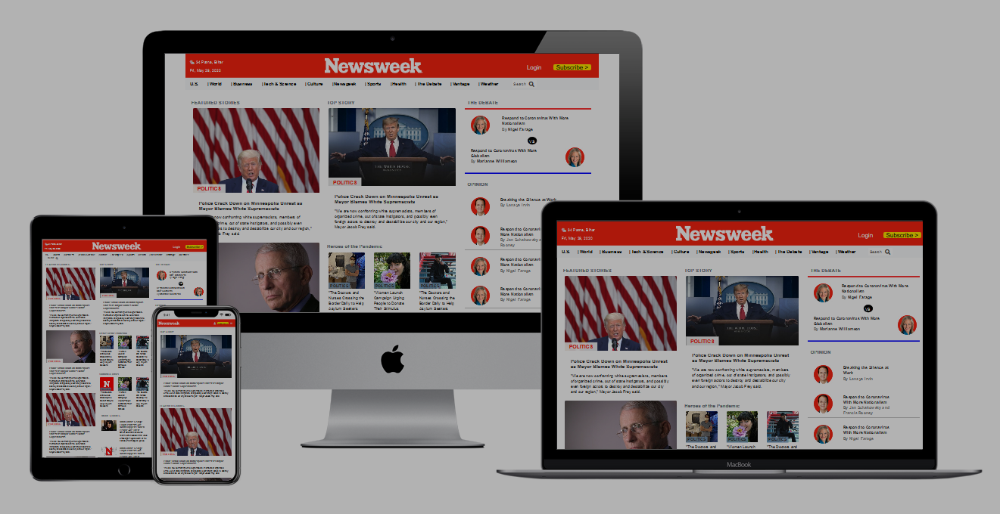

# Newsweek_replica
This is a clone version of newsweek website. It has uses of bootstrap framework of CSS, with the help of this project, I got to know how to use bootstrap.

## Project Design

Project Design Screenshot : 

## Built With

- HTML5
- CSS3
- Bootstrap 4
- Font Awesome icon
- Media Queries

## Original Website

[Original website link](https://www.newsweek.com/)

## Live Demo

[Live Demo Link](https://raw.githack.com/Dipeshtwis/Newsweek_replica/feature-newsweek-replica/index.html)


# Github link:

For the: [Github-link](https://github.com/Dipeshtwis/Newsweek_replica/tree/feature-newsweek-replica)

# Getting Started 🚀

These instructions will get you a copy of the project up and running on your local machine.

## How To Use 🔧

From your command line, first clone the project:

```bash
# Clone this repository
$ git clone https://github.com/Dipeshtwis/Newsweek_replica.git

# Go into the repository
$ cd Newsweek_replica

```

## CONTRIBUTOR

👤 **Dipesh Kumar**

- [Github](@Dipeshtwis)
- [Twitter](@97deepeshkumar)
- [Linkedin](https://www.linkedin.com/in/dipesh-kumar-b6ab88134/)


## Show your support

Give a ⭐️ if you like this project!

## Acknowledgments

- Thanks to Microverse and The Odin Project.

